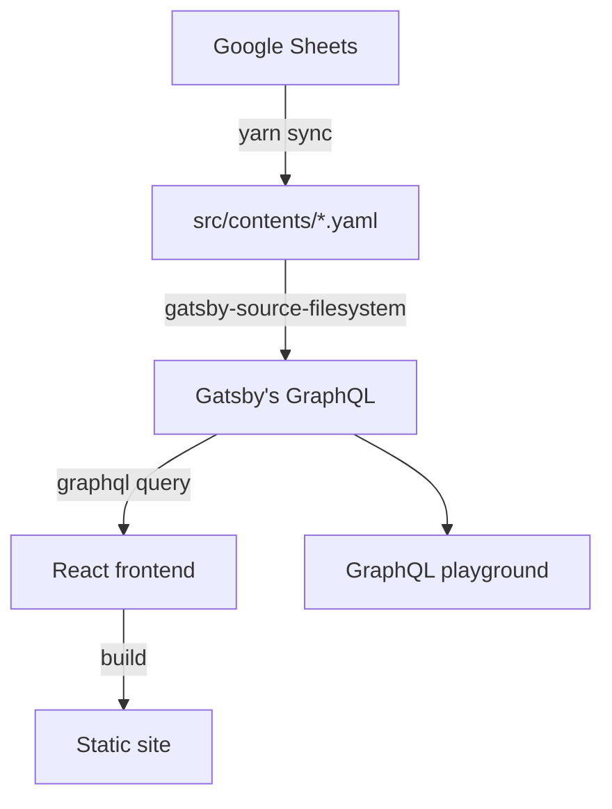

# They Work For Us

An open-source politician directory project for listing and tracking activities of members of the Cabinet and National Assembly of Thailand. It's run on [Gatsby](https://www.gatsbyjs.org).

## 👓 Table of Contents

- [Environments](#environments)
- [Development](#development)
- [Sync Data](#sync-data)
- [Getting Started for Contributers](#getting-started-for-contributers)
- [Reference](#reference)
  - [Data Dictionary](#data-dictionary)
- [Glossary](#glossary)

## 🌎 Environments

|                     Environment                     |                Description                |
| :-------------------------------------------------: | :---------------------------------------: |
| [Staging](https://staging.theyworkforus.wevis.info) | Non-release features for internal testing |
|   [Production](https://theyworkforus.wevis.info)    |              Public website               |

## 🍳 Development

After installing NodeJS and `yarn`, you can start in development mode by

```console
yarn start
```

Your site is running on `http://localhost:8000` and GraphQL playground on `http://localhost:8000/___graphql`.

## 📑 Sync Data

Data sources are maintained on [Google Sheets](https://docs.google.com/spreadsheets/d/1kcom8zgR-FMCGu78bCwilxq5-GrE4NVr5cE4L7geUuo) by contributors. We have script to fetch and transform it into YAML files, which will be consumed by Gatsby.



To sync data and append latest changes to `src/contents/*.yaml`, run:

```console
yarn sync
```

## 🙋 Getting Started for Contributers

- Issues with **"help wanted"** tag can be picked up, and assign yourself to the issue.
- We ain't no dictatorship! Feel free to suggest an idea, and use the techniques/tools you prefer.
- The codebase is not so nice, to be honest. Feel free to ask or discuss any concern in the issue.
- When you are done or need help, submit the PR to the repository for a review.

Thank you for your contribution and enjoy coding!

## 📖 Reference

## Data Dictionary

- [Data-Dictionary](https://github.com/codeforthailand/politician-directory/wiki/Data-Dictionary)

## Glossary

| Thai                        | English                                |
| --------------------------- | -------------------------------------- |
| คณะรัฐมนตรี                 | Cabinet                                |
| พรรคการเมือง                | Party                                  |
| วุฒิสภา                     | The Senate                             |
| รัฐสภา                      | National Assembly of Thailand          |
| สภาผู้แทนราษฏร              | The House of Representatives           |
| สมาชิกวุฒิสภา (ส.ว.)        | Senator                                |
| สมาชิกสภาผู้แทนราษฎร (ส.ส.) | Member of the House of Representatives |
